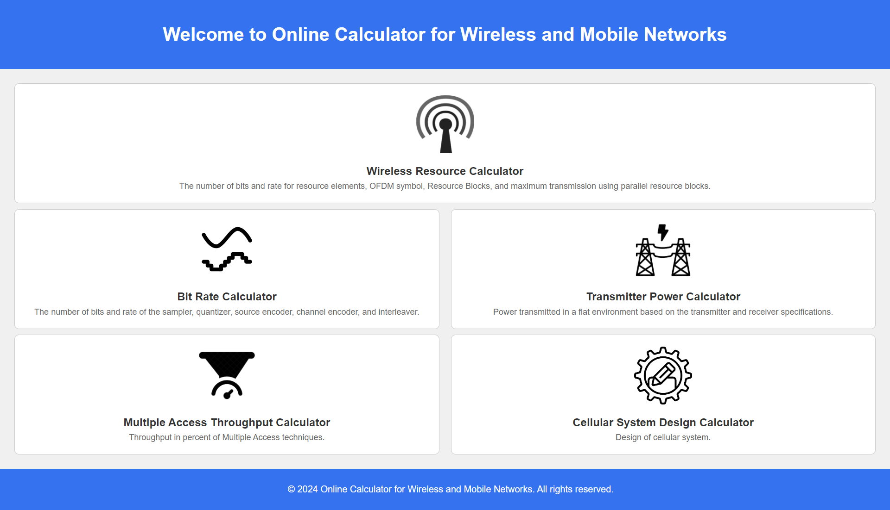

# Online Calculator for Wireless and Mobile Networks

## Project Description

Design and build an online calculator to facilitate various computations for wireless and mobile networks. The application aims to provide a user-friendly and efficient experience. Here's a breakdown of the required functionalities:

### 1. Calculator Functionalities

The online calculator will allow users to input system parameters and perform the following computations:

1. **Sampling and Encoding Calculations:**
   - Number of bits and rate for the sampler, quantizer, source encoder, channel encoder, and interleaver.

2. **Resource Calculations:**
   - Number of bits and rate for resource elements, OFDM symbols, Resource Blocks, and maximum transmission using parallel resource blocks.

3. **Power Calculations:**
   - Power transmitted in a flat environment based on transmitter and receiver specifications.

4. **Throughput Calculations:**
   - Throughput percentage for Multiple Access techniques.

5. **Cellular System Design:**
   - Parameters and design considerations for cellular systems.

Each calculation module will prompt the user to input the necessary maximum system parameters to solve the computations.

### 2. User Interface

The application will be built using HTML, CSS, and JavaScript, ensuring a responsive and intuitive interface. Users will be able to easily navigate through different calculators and input required data efficiently.

## Gallery

### Initial Photo

  
Click to show all photos

  ### Screen2
  

  ### Screen3
  

  ### Screen4
  

  ### Screen5
  

  ### Screen6
  

  ### Screen7
  

  ### Screen8
  

## How to Run

- Clone the repository to your local machine.
- Open the `index.html` file in a web browser.

## Languages And Tools:

   
